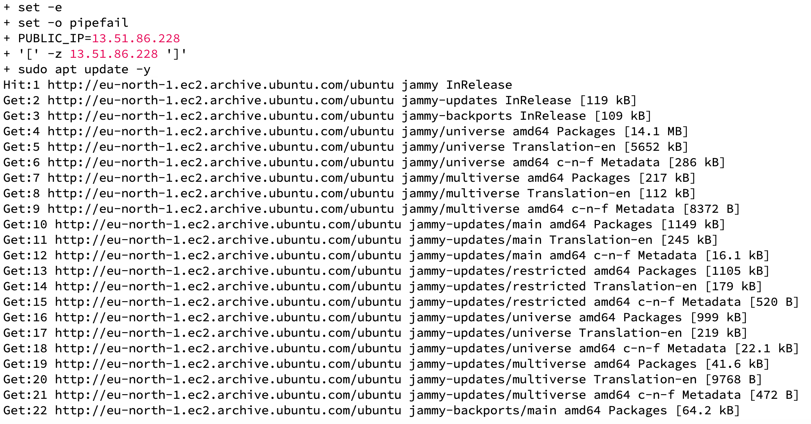
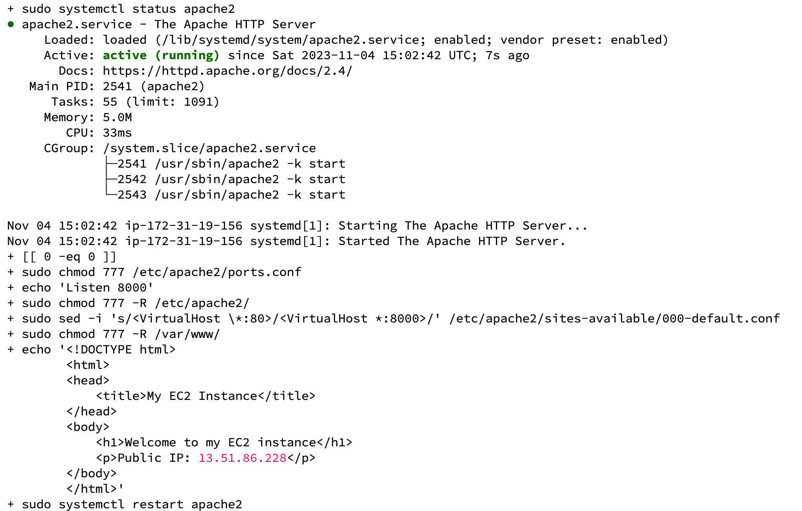
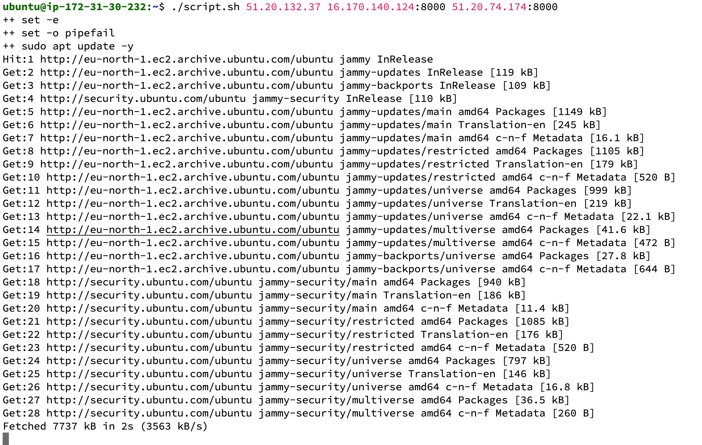
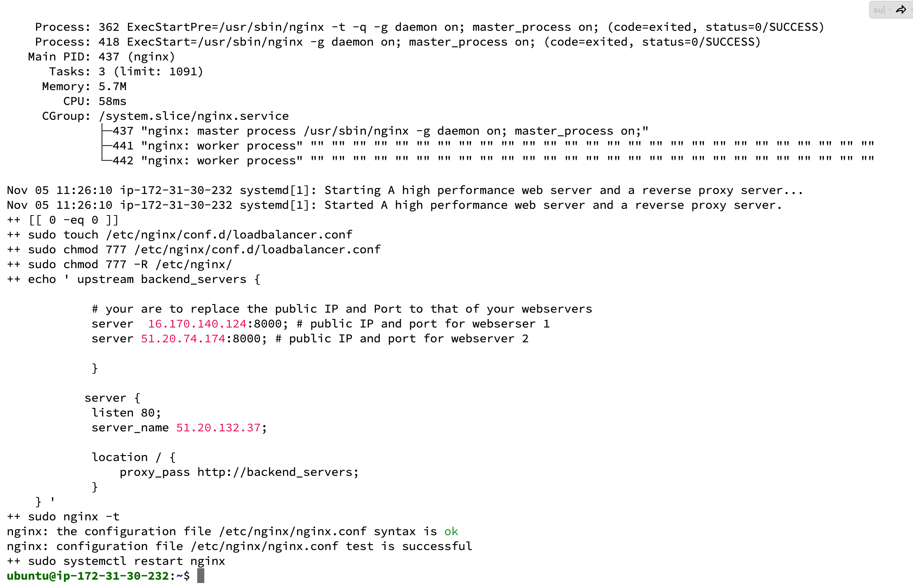
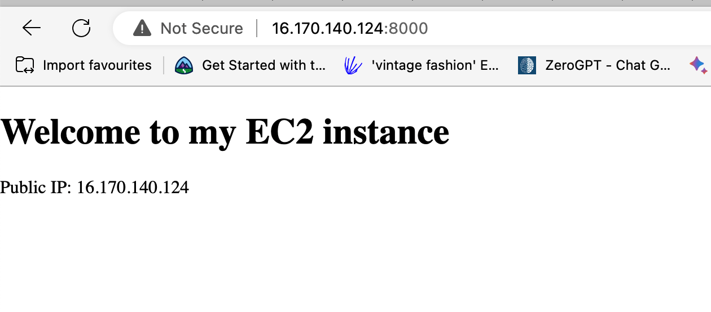
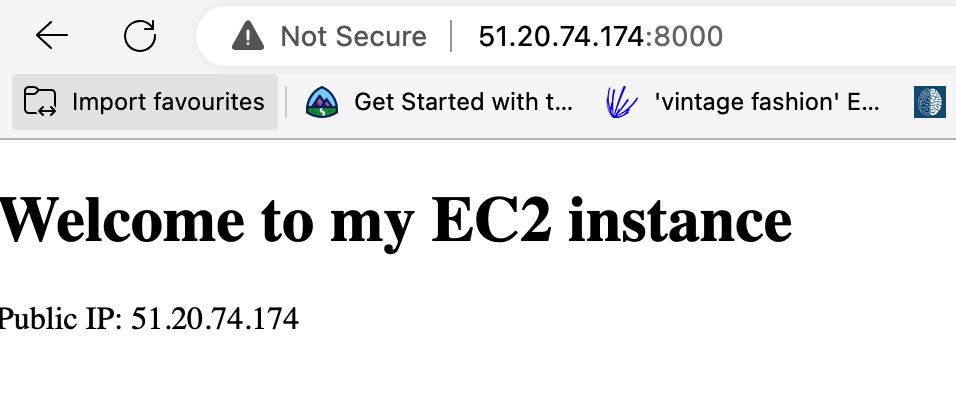
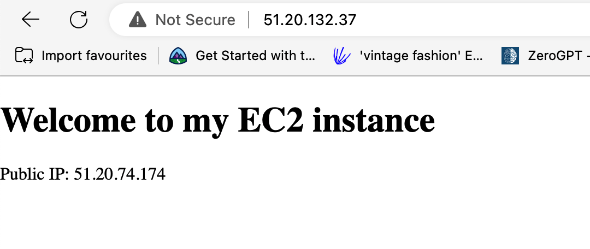
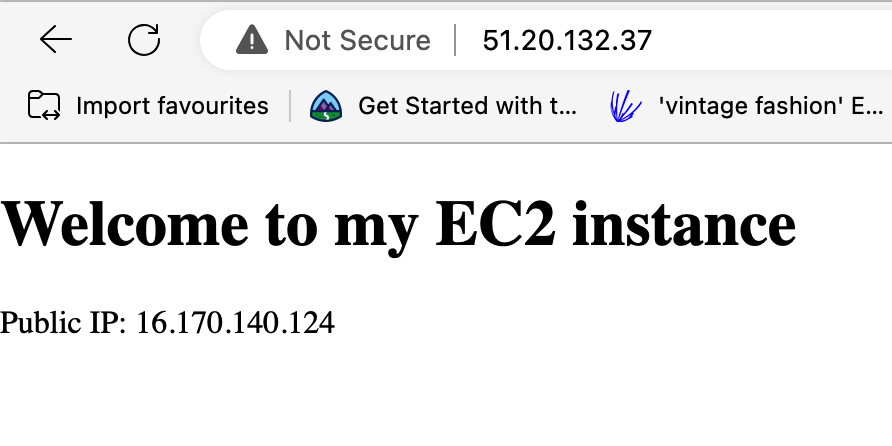

# Automating Loadbalancer Configuration with Shell Script

In this article, we will talking about how we can automate and simulate the Load balancing effect of different servers using shell scripts and CI/CD on jenkins.

### Step 1: Automate the deloyment of webservers

We want to automate the process of deploying a webservers. As DevOps engineers, automation is the heart of what we do to ensure smooth operations.

# Deploying and Configuring web servers

The script below will configure our EC2 instance or web server installing apache web server, port configuration, virtual host configuration.

#### Step1: 

Provision an EC2 instance 

#### Step2: 

Open port 8000 to allow traffic from all sources on the security group setting


#### Step3: 

Connect the webserver via the terminal using SSH client

#### Step4: 

Open a file and paste the script below, save, add the permission (=> sudo +x script_name.sh)


```

#!/bin/bash

####################################################################################################################
##### This automates the installation and configuring of apache webserver to listen on port 8000
##### Usage: Call the script and pass in the Public_IP of your EC2 instance as the first argument as shown below:
######## ./install_configure_apache.sh 127.0.0.1
####################################################################################################################

set -x # debug mode
set -e # exit the script if there is an error
set -o pipefail # exit the script when there is a pipe failure

PUBLIC_IP=$1

[ -z "${PUBLIC_IP}" ] && echo "Please pass the public IP of your EC2 instance as an argument to the script" && exit 1

sudo apt update -y &&  sudo apt install apache2 -y

sudo systemctl status apache2

if [[ $? -eq 0 ]]; then
    sudo chmod 777 /etc/apache2/ports.conf
    echo "Listen 8000" >> /etc/apache2/ports.conf
    sudo chmod 777 -R /etc/apache2/

    sudo sed -i 's/<VirtualHost \*:80>/<VirtualHost *:8000>/' /etc/apache2/sites-available/000-default.conf

fi
sudo chmod 777 -R /var/www/
echo "<!DOCTYPE html>
        <html>
        <head>
            <title>My EC2 Instance</title>
        </head>
        <body>
            <h1>Welcome to my EC2 instance</h1>
            <p>Public IP: "${PUBLIC_IP}"</p>
        </body>
        </html>" > /var/www/html/index.html

sudo systemctl restart apache2

```




### Summary

From the above, we provisioned an EC2 isntance and opened port 8000 to allow all connections, made it server Listen on port 8000 and also added port 8000 on the virtual host. Now, we deploy Nginx on another server (Instance) opening port 80


## Deploying Nginx as LoadBalancer with bashscript

Since we have provisioned 2 EC2 instances, let us configure the second instance to listen on port 80 and open port 80 to allow all connections from anywhere in the security group settings.

## Deploying and Configuring Nginx LoadBalancer

The following script has been written in such a way that all steps involved to configure a Loadbalancer will be carried out.


```

#!/bin/bash

######################################################################################################################
##### This automates the configuration of Nginx to act as a load balancer
##### Usage: The script is called with 3 command line arguments. The public IP of the EC2 instance where Nginx is installed
##### the webserver urls for which the load balancer distributes traffic. An example of how to call the script is shown below:
##### ./configure_nginx_loadbalancer.sh PUBLIC_IP Webserver-1 Webserver-2
#####  ./configure_nginx_loadbalancer.sh 127.0.0.1 192.2.4.6:8000  192.32.5.8:8000
############################################################################################################# 

PUBLIC_IP=$1
firstWebserver=$2
secondWebserver=$3

[ -z "${PUBLIC_IP}" ] && echo "Please pass the Public IP of your EC2 instance as the argument to the script" && exit 1

[ -z "${firstWebserver}" ] && echo "Please pass the Public IP together with its port number in this format: 127.0.0.1:8000 as the second argument to the script" && exit 1

[ -z "${secondWebserver}" ] && echo "Please pass the Public IP together with its port number in this format: 127.0.0.1:8000 as the third argument to the script" && exit 1

set -x # debug mode
set -e # exit the script if there is an error
set -o pipefail # exit the script when there is a pipe failure


sudo apt update -y && sudo apt install nginx -y
sudo systemctl status nginx

if [[ $? -eq 0 ]]; then
    sudo touch /etc/nginx/conf.d/loadbalancer.conf

    sudo chmod 777 /etc/nginx/conf.d/loadbalancer.conf
    sudo chmod 777 -R /etc/nginx/

    
    echo " upstream backend_servers {

            # your are to replace the public IP and Port to that of your webservers
            server  "${firstWebserver}"; # public IP and port for webserser 1
            server "${secondWebserver}"; # public IP and port for webserver 2

            }

           server {
            listen 80;
            server_name "${PUBLIC_IP}";

            location / {
                proxy_pass http://backend_servers;   
            }
    } " > /etc/nginx/conf.d/loadbalancer.conf
fi

sudo nginx -t

sudo systemctl restart nginx

```

#### Output





### Summary 

Create 1 EC2 instance (Public IP) and open port 8000,22,80 on the security group


### Step1

Create a new script `nginx.sh`, copy and paste the above script.

### Step2

Make the file executable by running => chmod +x nginx.sh

### Step3

Run with ./nginx.sh Public_IP IP_Webserver1 IP_Webserver2

Public_IP is the server with Nginx config while IP_Webservers1&2 were configured with apache server from the first script

# Verifying the Setup









Annnnnnndddddddd BOOM!!! Successfully automated Loadbalancing 